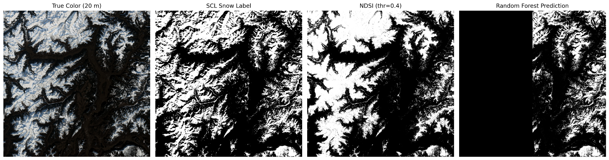

# Snow Cover Segmentation in the Alps (Sentinel‑2 + RF baseline)

This repository contains the final project for **AI4EO**: a reproducible pipeline for **snow / no‑snow segmentation** over the Alps using **Sentinel‑2 L2A** imagery. We compare a classical **NDSI** threshold with a supervised **Random Forest** classifier trained on the **Scene Classification Layer (SCL)** as pseudo‑labels. We use **geographic cross‑validation** (train left half → test right half, and vice‑versa).

<p align="center">
  
</p>

## Results (single tile T32TPS, 2024‑01‑28)

- Overall accuracy ≈ **93.6%** for both splits  
- Snow IoU **0.786** (Left→Right) and **0.869** (Right→Left)  
- See `outputs/metrics_geocv.txt` for full classification reports.

## Repository layout

```
ai4eo-snow-segmentation/
├── notebooks/
│   └── Final_Project.ipynb        # end-to-end workflow (load bands, labels, train, eval, plot)
├── figures/
│   ├── sentinel_rgb.png           # true color context
│   └── figure_comparison.png      # RGB, SCL, NDSI, RF side-by-side
├── outputs/
│   └── metrics_geocv.txt          # precision/recall/F1/IoU for both splits
├── data/                          # put your .SAFE folder(s) here (ignored by git)
├── requirements.txt               # Python deps
├── environment.yml                # optional Conda env (Apple Silicon friendly)
├── .gitignore
├── LICENSE
├── AI4EO-FinalReport.pdf          # final PDF report
└── README.md
```

## Quick start

1) **Clone** and create environment
```bash
git clone <YOUR-REPO-URL>.git ai4eo-snow-segmentation
cd ai4eo-snow-segmentation

# Option A: conda (recommended on Apple Silicon)
conda env create -f environment.yml
conda activate ai4eo-snow

# Option B: pip
python3 -m venv .venv && source .venv/bin/activate
pip install -r requirements.txt
```

2) **Place data**  
Download a Sentinel‑2 L2A product (tile **T32TPS**, date e.g. **2024‑01‑28**) and place the `.SAFE` folder under `data/`:
```
data/
└── S2A_MSIL2A_20240128T101301_N0510_R022_T32TPS_20240128T121856.SAFE/
```

3) **Run the notebook**  
Open `notebooks/Final_Project.ipynb` and set:
```python
SAFE_DIR = "data/S2A_MSIL2A_20240128T101301_N0510_R022_T32TPS_20240128T121856.SAFE"
```
Run all cells. Outputs and figures will be reproduced.

## Notes

- **Labels**: we derive Snow/No‑snow from Sentinel‑2 **SCL** (`11 = snow`, `4/5 = no snow`), ignoring others.
- **Features**: B02, B03, B04, B8A, B11, B12 + NDSI; all resampled to a common 20 m grid.
- **Split**: **geographic** (left/right halves) to avoid overly optimistic random-split scores.
- **Half‑black panel**: black denotes **invalid/withheld** regions (e.g., the training half or non‑labelled pixels).

## Citations / Acknowledgements

- Barrou‑Dumont et al., 2021. *Copernicus High‑Res Snow & Ice* (The Cryosphere).  
- Hall et al., 1995–2002. *MODIS Snow*.  
- Breiman, 2001. *Random Forests*.  
- scikit‑learn, rasterio, numpy, matplotlib.

Prepared by **Ahmed Habib & Lucas Velciov** · 2025-10-06
